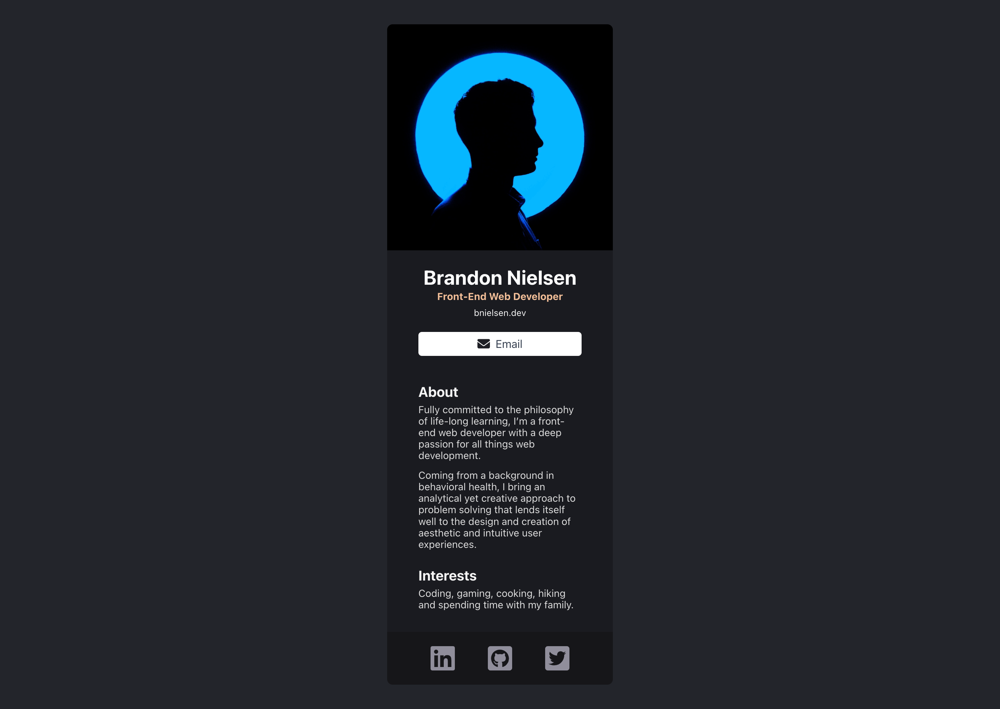
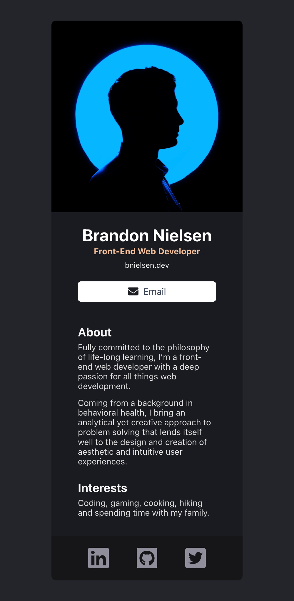

# Digital Business Card - Scrimba React Course Project

## Table of Contents

- [Overview](#overview)
  - [Screenshots](#screenshots)
  - [Links](#links)
  - [Built with](#built-with)
- [Author](#author)

## Overview

### Screenshots

#### Desktop

#### Mobile

### Links

- Solution URL: [https://github.com/bnielsencodes/digital-business-card](https://github.com/bnielsencodes/digital-business-card)
- Live Site URL: [https://bnielsen.dev/digital-business-card](https://bnielsen.dev/digital-business-card)

### Built with

- React
- Create React App
- Semantic HTML5 markup
- Flexbox
- Mobile-first workflow

## Author

- Website - [Brandon Nielsen](https://www.bnielsen.dev)
- LinkedIn - [Brandon Nielsen](https://www.linkedin.com/in/bnielsencodes)
- Twitter - [@bnielsencodes](https://twitter.com/bnielsencodes)
- Frontend Mentor - [@bnielsencodes](https://www.frontendmentor.io/profile/bnielsencodes)
